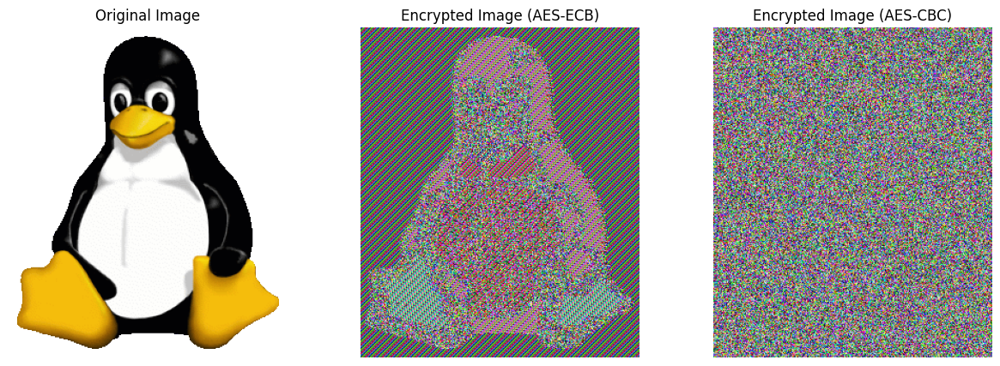

Left: Original image

Middle: ECB-encrypted image showing patterns

Right: CBC-encrypted image — looks like noise, no visible pattern leak

Clearly see why CBC is preferred over ECB for encrypting images or any data where structure matters.