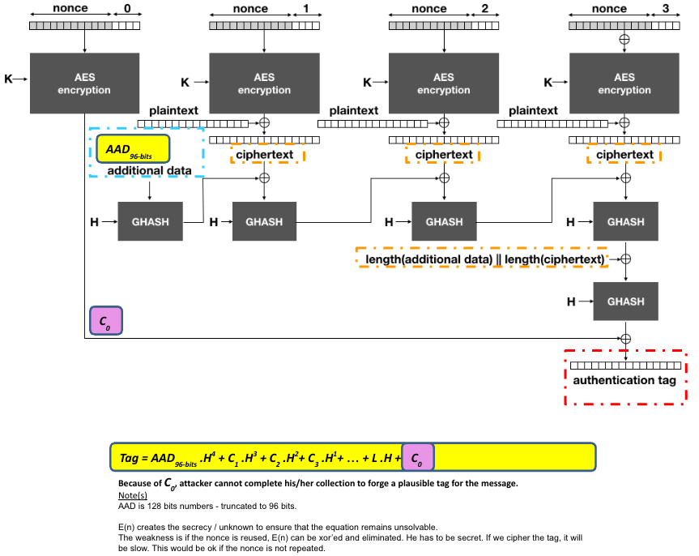

# 🔐 Why is the key exhaustion at ~64 GB limit for AES-GCM?

Here is the breakdown: 
2³²  = 4_294_967_296 bytes

4 GB (since 1 GB = 2³⁰ = 1_073_741_824) 

64 GB = 64 × 2³⁰ = 2⁶ × 2³⁰ = 2³⁶ bytes

For 64 GB, this comes down to how AES-GCM handles its internal counters and maximum message size, especially during encryption under a single key and nonce.

AES-GCM uses a 32-bit block counter when constructing its IV (Initialization Vector) for CTR (counter) mode encryption.

- AES operates on 128-bit (16-byte) blocks.
- The GCM mode uses a 32-bit (4-byte) counter as part of the 96-bit nonce+counter (in the IV).
- Therefore, the counter can count up to:
	2³² blocks (4,294,967,296 blocks) 
		= 2³² x 16 bytes (68,719,476,736 bytes) 
		= 2³⁶ bytes ((4,294,967,296)/(1,073,741,824)) = 64 GB
* _each block is 16 bytes_

| Term               | Size in bytes                        |
| ------------------ | ------------------------------------ |
| **1 GB (decimal)** | 1,000,000,000 bytes                  |
| **1 GiB (binary)** | 1,073,741,824 bytes = $2^{30}$ bytes |


Under a single key and nonce combination:
- You can encrypt up to 2³² blocks (64 GB) safely.
- Exceeding this causes counter reuse, which breaks the security of AES-CTR (and thus GCM).

🚨 Important:
This 64 GB limit is per key/nonce pair. You can encrypt more data if you:
- Use a different nonce with the same key, or
- Rotate keys if you're encrypting large data streams



## Where the 96 bits come into play in AES-GCM?
### Why it's not part of the 2³² × 16 = 2³⁶ bytes = 64 GB limit calculation?

🔍 Breakdown of the 96-bit number:
In AES-GCM, the IV (Initialization Vector) is typically 96 bits (i.e., 12 bytes). This is the recommended length because it allows the internal counter construction to be super efficient.

Look at how that 96-bit IV is used:

📦 Construction of the counter block:
When using a 96-bit IV, AES-GCM builds the 128-bit counter block (J₀) like this:
```
J₀ = IV || 0x00000001

- IV: 96 bits
- 0x00000001: 32-bit fixed integer (starting counter value)
```
Then, for each 128-bit AES block, the counter value increments:
```
J₁ = IV || 0x00000002
J₂ = IV || 0x00000003
...

J_{2^32 - 1} = IV || 0xFFFFFFFF
```
So the 96-bit IV acts as a prefix, and the 32-bit counter is the suffix.

The 96-bit IV in AES-GCM can represent a session, message, or record ID, depending on how you're structuring your data. Its role is to guarantee uniqueness and ensure security of the encryption and authentication process.

⚠️ Security Reminder
IV reuse in AES-GCM with the same key is catastrophic. So:
- Think of the IV as your anti-replay and anti-reuse token.
- If your “session” means a unique message or record, it’s a good abstraction.
- The counter mechanism ensures non-repeating ciphertext blocks, preventing patterns that could otherwise mimic ECB-mode weaknesses.

🧠 The 64 GB Limit
Where the 2³² comes from:
- You're allowed to increment that 32-bit counter up to 2³² - 1.
- Since each block is 16 bytes → 2³² × 16 = 2³⁶ bytes = 64 GB

✅ The 96-bit IV is not part of the data size limit — it just sets the static part of the counter block. The 32-bit counter is what actually limits how much data you can encrypt under one IV/key combo.


| Component              | Purpose                                                |
| ---------------------- | ------------------------------------------------------ |
| **96-bit IV**          | Prefix for counter block (J₀)                          |
| **32-bit counter**     | Suffix that gets incremented (limits us to 2³² blocks) |
| **16-byte AES blocks** | Each counter encrypts 16 bytes                         |
| **64 GB limit**        | = 2³² blocks × 16 bytes = 2³⁶ bytes                    |


# Collision resistance aspect of AES-GCM, and the Birthday Paradox
This plays a crucial role in its security bounds.

🔐 AES-GCM and the Birthday Bound
AES-GCM provides authenticated encryption, meaning it offers both:
- Confidentiality (via AES in CTR mode), and
- Integrity/Authentication (via GMAC = Galois Message Authentication Code)

🎂 Where the Birthday Paradox 
The Birthday Paradox applies to the authentication tag generation in GCM, not the encryption part.
- AES-GCM uses a 128-bit tag (typical default, configurable).
- This tag is the result of a polynomial hash over GF(2¹²⁸) — essentially a keyed hash (GHASH) derived from the plaintext and AAD (Additional Authenticated Data).
- The tag is supposed to be unique per key/nonce combination, protecting against forgeries.

🤯 The problem: Due to the birthday paradox, if an attacker sees around:
$2^{n/2}$ = 2⁶⁴

Authentication tags (where 𝑛 = 128 is the tag size), then the probability of a collision becomes non-negligible — which could allow forgeries or plaintext recovery depending on the scenario.

🎯 AES-GCM has a security limit of about 2⁶⁴ encryptions per key because of the birthday bound on 128-bit tags.

| Limit                                 | Bound                   | Reason                                           |
| ------------------------------------- | ----------------------- | ------------------------------------------------ |
| **Max message size per (key, nonce)** | $2^{36}$ bytes (64 GiB) | 32-bit counter exhaustion                        |
| **Max total messages per key**        | \~ $2^{64}$ messages     | Birthday bound on 128-bit tag (GHASH collisions) |


## 🔄 What Happens if You Go Past $2^{64}$  Tags?
If you encrypt or verify more than 2⁶⁴ messages under the same key (regardless of nonce), the chance of two tags colliding becomes significant, breaking the integrity guarantees of GCM. An attacker might:
- Forge a valid tag for a modified message
- Reuse a tag in a replay attack
- Learn about relationships between plaintexts

✅ Note 
- Rotate keys long before you hit $2^{64}$ messages.
- Always use unique nonces per key to avoid catastrophic failures.
- Consider alternatives like AES-SIV or XChaCha20-Poly1305 for better misuse resistance if random or repeated nonces are possible.

This works the same for AES-256-GCM, which uses a 256-bit key instead of a 128-bit one. 

### What changes and what doesn’t when you switch from AES-128-GCM to AES-256-GCM?

| Feature        | AES-128-GCM           | AES-256-GCM           |
| -------------- | --------------------- | --------------------- |
| Key size       | 128 bits              | 256 bits              |
| Block size     | 128 bits              | 128 bits              |
| Tag size       | Typically 128 bits    | Typically 128 bits    |
| IV (nonce)     | 96 bits (recommended) | 96 bits (recommended) |
| Tag generation | GHASH over GF(2¹²⁸)   | GHASH over GF(2¹²⁸)   |

Note: Despite the larger key size, the block size, tag size, and GHASH field stay the same. This is critical.

# 🎂 Birthday Bound Still Applies to the Tag (128-bit)
AES-256-GCM still uses a 128-bit authentication tag, which means:
- The birthday bound is unchanged: $2^{(128/2)}$ = $2^{64}$
- The risk of tag collisions and forgery due to the Birthday Paradox still kicks in after ~2⁶⁴ encryptions under the same key.

> 💡 Even with a 256-bit key, the integrity security is still only ~128 bits because the tag is 128 bits.

🧠 What Does AES-256 Really Give You?
✅ Stronger confidentiality (against brute-force attacks on the key) — 256-bit key is harder to crack than 128-bit
- 🚫 No improvement in integrity (authentication strength is still 128-bit)
- 🚫 No change in the birthday bound — you still face ~2⁶⁴ limit before tag collisions become likely
- 🚫 No change in the 64 GiB per-nonce limit (from 2³² × 16-byte blocks)

| Concern                                   | AES-256-GCM                |
| ----------------------------------------- | -------------------------- |
| **Per-nonce data limit**                  | 64 GiB (2³² × 16 bytes)    |
| **Max encryptions before integrity risk** | $\approx 2^{64}$           |
| **Key size**                              | 256 bits                   |
| **Tag size (affects birthday bound)**     | 128 bits                   |
| **Block size**                            | 128 bits (same as AES-128) |

Note: If you're concerned about integrity longevity beyond 2⁶⁴  messages, consider increasing the tag size (to 192 or 256 bits if supported) — or using different AEAD constructions with wider authentication fields.

Simulate a birthday paradox attack that shows tag collisions in AES-GCM, but note:

> Real forgery attacks on AES-GCM due to birthday collisions require deep control over message construction and access to many encryptions under the same key/IV setup — and that's computationally infeasible in practice unless the developer misuses the system (e.g., nonce reuse or extremely high traffic under one key).

Simulation that approximates the Birthday Paradox over 128-bit tags, focusing on how collisions become likely after ~2⁶⁴ tags. 
Weaken tag: Downscale this to 32 or 64-bit tags so we can observe collisions faster in code.

With a 32-bit tag, the birthday bound hits around $2^{16}$ messages.
With 128-bit tags (real GCM), the bound is ∼ $2^{64}$ — far too large to simulate without a supercomputer.

🧠 Key Takeaways
1. The Birthday Paradox means: the probability of two outputs colliding rises sharply after √ $2^{n}$  = $2^{(n/2)}$  samples.
2. For 128-bit tags, that’s $2^{64}$  encryptions.
3. If you're reusing nonces, or hitting those limits, you're violating AES-GCM's security assumptions — and attacks like tag forgery become viable.


## 🔁 Simulation:

1. Generate many different plaintext messages under the same key and nonce (⚠️ misuse).
2. AES-GCM produces a ciphertext with a 128-bit authentication tag.
3. Truncate the tag to e.g. 32 bits to simulate birthday collisions.
4. Eventually, 2 different messages yield the same truncated tag — that’s the collision.

> 💥 The collision is in the tag (used to authenticate the message), not the ciphertext or plaintext directly.

## 🔁 Simulation:
1. Forgery attack using AES-GCM when:
2. Attacker knows 2 different messages produce the same (truncated) authentication tag under the same key and nonce.
3. Attacker takes the tag from 1 message, applies it to another forged ciphertext, and fools the decryptor into accepting a fake message.

> 🔥 This misuse works when:
> 1. Tags are truncated (i.e., less than 128 bits)
> 2. Nonce reuse occurs
> 3. Enough encryptions are done to hit a birthday collision


