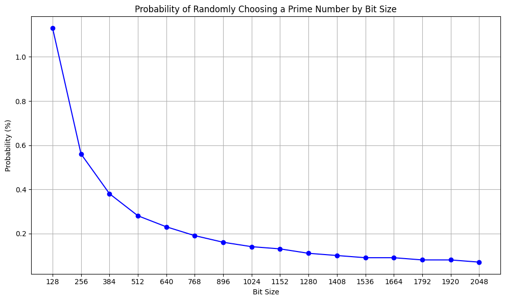
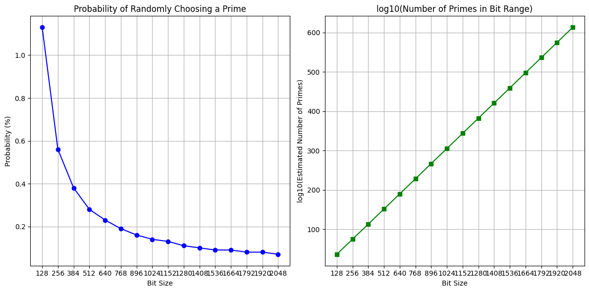
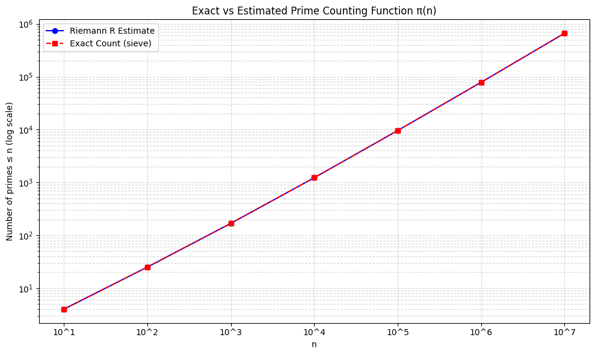

# Prime Density Estimator by Bit Size

This Python script estimates the number of prime numbers between `2^(n-1)` and `2^n` for a range of bit sizes using the **Riemann R function**. It also plots the **probability of randomly selecting a prime number** in that range.


There are around 8.37x10⁷⁷ electrons in the universe. And, while that might seem like a large number, the estimated number of 512-bit prime numbers is:

18906370642694533330255267422559435438516148269380861172414282021437571915512683767157742768034244490543655250659082340701872652735175220791902826659840

and which is 1.5x10¹⁵¹. In fact, for RSA, we can use 2,048-bit prime numbers for 4096-bit RSA, and as an estimate, the total number of prime numbers is:

11385172270258672953764793456388645214256740287188220237389104580032209792659193924101416597006335941813038755260878001567334933908725291403697392808828239764599609819731878152305734495554617798558938055499227953935671432466474597689981539404264108325526516247781591774691266828619629734180673225660241271543591391989708758169413624895421128195230477399212718531210499701272562448816178087091221785420932500650269661768355526533958545122702304553518111237381614796970882146854046586446112589627992086028076057005913397168273375915681546605655773788353223659319186860982233577649003599445529974508879522956597788672

and which is around 1.1x10¹⁰²³. There are thus more prime numbers in the universe than there are electrons in the universe.

### ✅ Python Function: Convert Integer to Scientific Notation a × 10^b

```
from decimal import Decimal, getcontext

# Set precision high enough to handle huge numbers
getcontext().prec = 150

def to_scientific_notation(n: int, precision: int = 3) -> str:
    """Convert a large integer to scientific notation like a × 10^b."""
    if n == 0:
        return "0"
    d = Decimal(n)
    exponent = d.adjusted()  # same as int(log10(d))
    mantissa = d.scaleb(-exponent).normalize()
    return f"{mantissa:.{precision}f}×10^{exponent}"

# 512-bit prime count
count_512 = 18906370642694533330255267422559435438516148269380861172414282021437571915512683767157742768034244490543655250659082340701872652735175220791902826659840

# 2048-bit prime count
count_2048 = 11385172270258672953764793456388645214256740287188220237389104580032209792659193924101416597006335941813038755260878001567334933908725291403697392808828239764599609819731878152305734495554617798558938055499227953935671432466474597689981539404264108325526516247781591774691266828619629734180673225660241271543591391989708758169413624895421128195230477399212718531210499701272562448816178087091221785420932500650269661768355526533958545122702304553518111237381614796970882146854046586446112589627992086028076057005913397168273375915681546605655773788353223659319186860982233577649003599445529974508879522956597788672

print("512-bit prime count (sci):", to_scientific_notation(count_512))
print("2048-bit prime count (sci):", to_scientific_notation(count_2048))

"""
512-bit prime count (sci): 1.891×10^151
2048-bit prime count (sci): 1.139×10^613
"""


```


## 📌 Features

- Estimates prime counts using the Riemann prime counting function `R(x)`
- Computes probability of randomly selecting a prime in a given bit-length range
- Batch analysis for bit sizes (default: 128 to 2048)
- Plots prime density vs. bit size using `matplotlib`

---

## 🧠 Background

In cryptography we sometimes have to estimate pi(x) , and which is the number of primes between 0 and x . This page estimate the number of primes for a given bit size and will use the Riemannr method.

One of the methods used is calculates the prime counting function π(x) using Schoenfeld’s inequality:

$$\ π(x) - li(x) < \frac{ (\sqrt(x)) * \log x }{8π} \$$

One method which can be used to estimate the number of prime numbers is the Riemann R function. This is a smooth approximation for π(x). The function is defined using the rapidly convergent Gram series:

$$\ R(x) = 1 + \sum^{\inf}_{k=1} \frac{\log^k x}{ k.k! \zeta (k+1) } \$$

The number of primes less than a number `x` can be estimated using the Riemann R function:

$$\ π(x) ≈ R(x) \$$


To find the number of primes in a bit range:

$$\ Count ≈ R(2^n) - R(2^{n-1}) \$$


Probability is computed as:

P(n) = (Estimated primes in range) / (Total numbers in range) × 100% 

Number of bits in prime number:	512
Estimated number of prime numbers:	961409783
Chance of finding a prime:		6.61 %


### ⚙️ Customize Range

```

To change the range or step size, modify:
generate_probability_plot(start_bits=128, end_bits=2048, step=128)

For example, to go from 256 to 1024 with 64-bit steps:
generate_probability_plot(start_bits=256, end_bits=1024, step=64)
```







If our attacker can tries 1 billion prime numbers per second, 

```
10⁵⁰ / 10⁹ = 10⁴¹ seconds ≈ 3.2×10³³ years
```

bits=⌊log2​(10^{50})⌋+1 = 166.0965 + 1 bits

If an attacker could try 1 billion prime numbers per second, and you chose a 166-bit prime number (around 10⁵⁰), the total number of primes they'd need to check is about 8.7×10^{47}. At that speed, it would take them about 2.76 × 10^{31} years — vastly longer than the age of the universe — to exhaust the search. This is why cryptographic keys use extremely large primes: to make brute-force attacks computationally infeasible.


