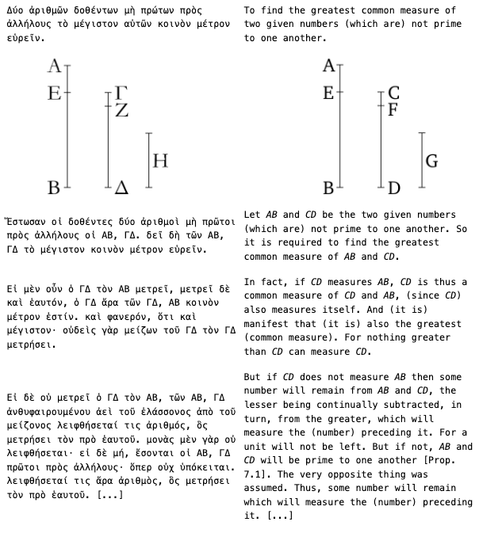

# Håstad’s Broadcast Attack on RSA with a small exponent (e = 3). 

This attack works when:

The same plaintext `m` is encrypted with e = 3 under 3 different RSA public keys `(n1, e)`, `(n2, e)`, `(n3, e)`

All ciphertexts are intercepted: `c1 = m^3 mod n1`, `c2 = m^3 mod n2`, `c3 = m^3 mod n3`

The `n`s are pairwise coprime.

The message `m` is small enough that `m^3 < n1 * n2 * n3`, so Chinese Remainder Theorem (CRT) can be used to recover `m^3`, and cube root gives `m`.

CRT aggregates the 3 ciphertexts into a single congruence that reveals m^3.

iroot from gmpy2 efficiently computes the integer cube root of m^3.

Since m^3 is less than the product of the moduli, it recovers the exact m.

## When `m^3 < n1 * n2 * n3 is not met`
Håstad's attack fails when the condition m^3 < n1 * n2 * n3 is not met — that is, when the plaintext is too large.

In this case:
CRT still reconstructs m^3 mod N, but since m^3 ≥ N, the result wraps around modulo N, and the cube root gives the wrong result.

You cannot recover the original message

| Condition            | Attack Works? |
| -------------------- | ------------- |
| `m^e < n1 * n2 * n3` | ✅ Yes         |
| `m^e ≥ n1 * n2 * n3` | ❌ No          |


# Common Factor Attack

Given a list of RSA public moduli $$\ 𝑛_𝑖 \$$, find pairs that share a prime factor by computing gcds. If gcd($$\ 𝑛_𝑖 \$$, $$\ 𝑛_j \$$) > 1, then that gcd is a shared prime factor, allowing factoring both keys and thus breaking their security.

## To adapt for real data
Extract moduli 𝑛 from PEM files:

Use the Python package pycryptodome:

```
from Crypto.PublicKey import RSA

def load_modulus_from_pem(filename):
    with open(filename, "rb") as f:
        key = RSA.import_key(f.read())
        return key.n
```

Load all 100 moduli into a list, then run the above vulnerability scan.

For each vulnerable key pair found, you can factor n = p * q and then reconstruct the private key using external tools or libraries, then decrypt corresponding messages.

Normally, for 2 keys $$\ 𝑛_1 = 𝑝 × 𝑞 \$$ and $$\ 𝑛_2 = 𝑟 × 𝑠 \$$, if 𝑝 , 𝑞 , 𝑟 , 𝑠 are all distinct primes, gcd(n1, n2) = 1. 

If a prime is reused, say $$\ 𝑛_1 = 𝑎 × 𝑏 $$\, $$\ 𝑛_2 = 𝑏 × 𝑐, then gcd(n1, n2) = b > 1. 

Detecting gcd > 1 quickly exposes 𝑏, allowing factorization and key compromise.

### ✅ 1. Extract Moduli from PEM Files
```
# extract_moduli.py
import os
from Crypto.PublicKey import RSA

def extract_moduli(folder_path):
    moduli = {}
    for filename in os.listdir(folder_path):
        if filename.endswith('.pem'):
            path = os.path.join(folder_path, filename)
            with open(path, 'rb') as f:
                key = RSA.import_key(f.read())
                moduli[filename] = key.n
    return moduli

if __name__ == "__main__":
    folder = "keys/"  # your folder of .pem files
    mods = extract_moduli(folder)
    for name, n in mods.items():
        print(f"{name}: {n}")


```

### ✅ 2. Reconstruct Private Key from p, q, and e
```
# reconstruct_key.py
from Crypto.PublicKey import RSA
from Crypto.Util.number import inverse
from Crypto.PublicKey.RSA import construct

def reconstruct_private_key(p, q, e=65537):
    n = p * q
    phi = (p - 1) * (q - 1)
    d = inverse(e, phi)
    key = RSA.construct((n, e, d, p, q))
    return key

# Example usage
if __name__ == "__main__":
    # Example small primes (do NOT use in real life)
    p = 134078079299425970995740249982058461274793658205923933
    q = 134078079299425970995740249982058461274793658205923939
    key = reconstruct_private_key(p, q)
    print(key.export_key().decode())

```

### ✅ 3. Decrypt Message with Private Key

```
# decrypt_message.py
from Crypto.PublicKey import RSA
from Crypto.Cipher import PKCS1_OAEP

def decrypt_file(key, ciphertext_path):
    with open(ciphertext_path, 'rb') as f:
        encrypted_data = f.read()

    cipher = PKCS1_OAEP.new(key)
    decrypted = cipher.decrypt(encrypted_data)
    return decrypted

# Example usage
if __name__ == "__main__":
    from reconstruct_key import reconstruct_private_key

    # Same example p and q as before
    p = 134078079299425970995740249982058461274793658205923933
    q = 134078079299425970995740249982058461274793658205923939

    key = reconstruct_private_key(p, q)

    decrypted_message = decrypt_file(key, "1.bin")
    print("Decrypted message:")
    print(decrypted_message.decode(errors='ignore'))

```

📝 Notes
These scripts assume:
- The PEM files are public keys (you can adapt for private).
- The messages (.bin) are RSA-encrypted using PKCS1-OAEP.

You must use correct pairs of p and q from a factored n for the decryption to work.

Use gcd(n1, n2) to find shared primes between moduli.


This demonstrates a critical vulnerability in RSA key generation caused by poor randomness during prime number selection. Specifically, it shows how reused or insufficiently random primes can lead to shared factors among public keys — a weakness exploited using greatest common divisor (GCD) calculations.

While factoring a single RSA modulus n=pq is computationally difficult, calculating the GCD of 2 moduli $$\ n_1, n_2 \$$ is fast. If gcd($$\ n_1, n_2 \$$) > 1, then 1 of the primes was reused, compromising both keys and allowing full factorization. 

This vulnerability was studied in-depth by Lenstra et al. and Heninger et al., who found thousands of weak RSA keys in real-world devices (routers, VPNs, printers) due to poor random number generation.

# 🔓 RSA GCD Attack: Cracking Keys with Shared Primes

This project demonstrates a real-world RSA vulnerability: **shared prime factors** between public keys due to faulty random number generation. If two RSA public moduli share a prime factor, they can be cracked instantly using the **Greatest Common Divisor (GCD)**.

## 🧠 Background

In RSA, the public key is a modulus \( n = p \times q \), where \( p \) and \( q \) are large random primes.

The private key relies on keeping \( p \) and \( q \) secret.

- Multiplying 2 primes is easy.
- Factoring a large number into its primes is hard.
- But if 2 moduli **share a prime**, then:
  
$$\
  \gcd(n_1, n_2) = p
\$$
  
  This reveals \( p \), allowing both moduli to be factored:
  
$$\
  q_1 = n_1 / p,\quad q_2 = n_2 / p
\$$

This exact attack was described by **Lenstra et al.** and **Heninger et al.**, who analyzed millions of public keys and found that ~0.2% were vulnerable due to bad randomness.

## 🚨 Real-World Impact

This vulnerability often affects:

- VPNs and firewalls
- Embedded or IoT devices
- Devices with low-entropy boot environments
- Improperly seeded RNGs

Once a shared factor is discovered, the private keys can be reconstructed, and encrypted messages can be decrypted.

## 🔍 What This Tool Does

1. Accepts a list of RSA moduli (n values from public keys).
2. Computes pairwise GCDs between all moduli.
3. Detects keys that share a common prime.
4. Factors the vulnerable moduli and outputs the prime pairs.

## 📦 How to Use

### 🔧 Requirements

- Python 3.6+
- [`pycryptodome`](https://pypi.org/project/pycryptodome/) (optional, for extracting `n` from PEMs)

View output for compromised key pairs and their prime factors.


# 🔓 Cracking Weak RSA Keys with GCD

This project shows how weak RSA keys can be broken if **two keys share a prime factor** — a real vulnerability found in many devices due to **bad random number generators**.

## 🧠 What’s the Problem?

In RSA encryption:

- A public key includes a number `n = p × q`, where `p` and `q` are secret large prime numbers.
- If `p` or `q` is reused in another key, we can find that using: gcd(n1, n2) = shared prime


This **instantly breaks both keys**, because once you know one prime, you can calculate the other.

This happened in real life! Researchers found **13,000+ weak keys** on real devices like printers, routers, and firewalls.

---

## 🔍 What This Project Does

- Reads a list of RSA public keys (modulus `n`)
- Compares every pair using GCD
- Detects shared primes
- Factors the weak keys

---

## 🔢 Simple Example

Suppose 2 public keys:
```
n1 = 7 × 13 = 91
n2 = 11 × 13 = 143
```

These look secure… unless someone checks:

gcd(91, 143) = 13 ← Shared prime!

Now we can factor both:
```
n1 = 91 → 13 × 7
n2 = 143 → 13 × 11
```

### 🔧 Cracking Keys Using GCD
Factoring large numbers (like RSA moduli) is hard and slow.

But computing the Greatest Common Divisor (GCD) between two numbers is fast — even for huge values.

GCD is the largest number that divides both inputs.

Example:
```
gcd(6, 9) = 3

gcd(10, 30) = 10

gcd(3, 7) = 1 (no common factors)
```
If 2 RSA keys accidentally share a prime, then:

```
gcd(n1, n2) = shared prime
```
And now both n1 and n2 can be easily factored, breaking both keys.

This works because GCD is quick, and doesn’t require full factorization.

We just broke both keys.

### ❌ Insecure Case (Shared Prime)
Suppose someone accidentally reuses a prime:
```
n1 = a × b

n2 = b × c ← ❗ shared prime b
```
Now:
```
gcd(n1, n2) = b  ← 🔓 weakness!
```
This shared prime lets an attacker instantly factor both n1 and n2, and recover the private keys.

| Case                 | GCD Result | Secure? |
| -------------------- | ---------- | ------- |
| All primes different | 1          | ✅ Yes   |
| One prime reused     | reused p   | ❌ No    |

### 🔓 GCD Shared Prime Attack
You're computing gcd(n1, n2) to discover a shared prime.

Once you find a shared prime, you factor the modulus and break the RSA key.

This attack uses Euclid’s algorithm, not CRT.

It’s about **detecting poor randomness**, not clever reconstruction.


| Feature                      | GCD Attack                       | Håstad’s Broadcast Attack        |
| ---------------------------- | -------------------------------- | -------------------------------- |
| Based on shared primes?      | ✅ Yes                            | ❌ No                             |
| Requires same message?       | ❌ No                             | ✅ Yes                            |
| Needs small exponent?        | ❌ No                             | ✅ Yes (`e = 3` or `e = 5`)       |
| Breaks one or multiple keys? | ✅ Yes, multiple if shared primes | 🔓 Decrypts message without keys |
| Requires factoring?          | ✅ Yes (once prime is found)      | ❌ No factoring needed            |


### 📐 Chinese Remainder Theorem (CRT)
CRT is a number-theoretic tool used in:

1. Efficient RSA decryption (on purpose):

Many RSA implementations (like OpenSSL) use CRT to speed up private key operations by computing mod p and q separately and recombining the result.

This is not a weakness, but an optimization.

2. Håstad’s Broadcast Attack (as an attack):

CRT helps combine ciphertexts encrypted under different moduli when the same plaintext was sent with small e (like e = 3).

Here, CRT is the core of the attack.

| Feature                | GCD Shared Prime Attack     | Chinese Remainder Theorem Use     |
| ---------------------- | --------------------------- | --------------------------------- |
| Type                   | Vulnerability detection     | Mathematical technique            |
| Used in attack?        | ✅ Yes                       | ✅ (in some attacks like Håstad’s) |
| Used for optimization? | ❌ No                        | ✅ Yes (in normal RSA decryption)  |
| Central idea           | GCD to detect shared primes | Combine residues / moduli         |
| Attack relies on CRT?  | ❌ No                        | ✅ Yes (in Håstad's)               |


## How unlikely is it that a prime number would be used in 2 different keys?
The 2 primes that go into a 1024-bit RSA key are generally both 512 bits long. (If multiply a j-digit number by a k-digit number, you can expect the answer to be around j+k digits long. Likewise with a j-bit and a k-bit number. This is based on the idea that $$\ b^j × b^k = b^{(j+k)} \$$.)

How many different 512-bit primes are there? A theorem called the Prime Number Theorem can be used to make a good estimate. It indicates that the fraction of numbers around the size of $$\ 2^{512} \$$ that are prime is around 1/($$\ 512 \ln 2 \$$)=0.0028... or around 0.28%. We can also test this experimentally with a random sample, which shows around the same result. Note that this includes all 512-bit even numbers, which are never prime, so about 0.6% of odd 512-bit numbers are prime.

There are somewhere between 2^{503} and 2^{504} 512-bit primes.

If random number generators are failing to produce truly unpredictable numbers, this can produce serious weaknesses in cryptography. 

---
## ✅ Why This Matters
RSA is only secure if keys are generated correctly. If devices use the same prime by accident (due to bad random number generators), millions of keys can be cracked in seconds. This project helps you detect and demonstrate that flaw.

1. $$\ n_1 \$$ and $$\ n_2 \$$ must be relatively prime to each other.

gcd($$\ n_1, n_2 \$$) = 1

Euclid considered the problem of finding the gcd of 2 integers in Elements, book VII, proposition 2, and gave a practical way to do it.



📚 References
Lenstra et al. (2012) — Ron was wrong, Whit is right (https://factorable.net/)

Heninger et al. (2012) — Mining Your Ps and Qs (https://factorable.net/)


