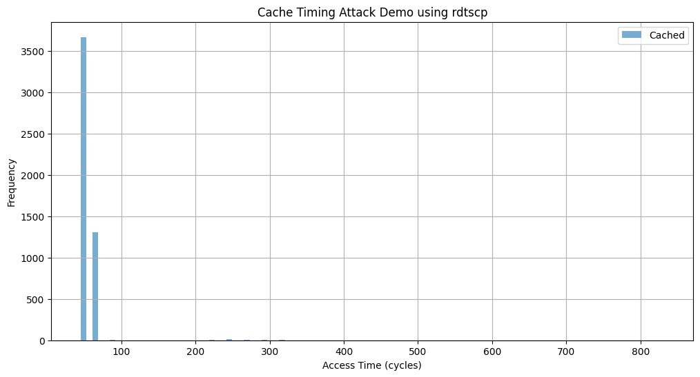

# Timing Observation On Cache-based Access Patterns
Timing attack demo in C to analyze cache-based access patterns (e.g., data being in or out of the CPU cache) using timing differences via memcmp.

1. Create a large memory block.
2. Randomly access or "guess" portions of that memory.
3. Use a timer (e.g., clock_gettime or rdtsc via inline assembly) to record access times.
4. Determine if the data is cached based on the timing.
5. Collect timings over multiple runs and plot the result in Python.

```
%%writefile timing_attack.c
#include <stdio.h>
#include <stdlib.h>
#include <string.h>
#include <time.h>
#include <stdint.h>
#include <x86intrin.h>

#define BLOCK_SIZE 64      // simulate a cache line
#define NUM_BLOCKS 1024    // total memory size = 64KB
#define NUM_TRIALS 10000   // number of tests

char *memory;

// Time access using rdtscp for precision
uint64_t time_access(void *ptr) {
    uint64_t start, end;
    volatile unsigned char tmp;

    start = __rdtscp(&start);
    tmp = *(volatile unsigned char *)ptr;
    end = __rdtscp(&end);

    return end - start;
}

int main() {
    memory = (char *)malloc(BLOCK_SIZE * NUM_BLOCKS);
    memset(memory, 1, BLOCK_SIZE * NUM_BLOCKS); // pre-fill memory

    srand(42); // fixed seed

    FILE *fp = fopen("timings.csv", "w");
    fprintf(fp, "trial,index,timing,was_cached\n");

    for (int i = 0; i < NUM_TRIALS; i++) {
        int index = rand() % NUM_BLOCKS;
        char *target = &memory[index * BLOCK_SIZE];

        // Sometimes flush the cache
        int flush = rand() % 2;
        if (flush) {
            _mm_clflush(target);
        }

        uint64_t t = time_access(target);

        fprintf(fp, "%d,%d,%lu,%d\n", i, index, t, !flush);
    }

    fclose(fp);
    free(memory);
    return 0;
}

```

Compile the C Program
Run It and Generate Timing Data

```
!gcc -O2 -o timing_attack timing_attack.c
!./timing_attack

```

Plot the Results 
```
import pandas as pd
import matplotlib.pyplot as plt

df = pd.read_csv("timings.csv")

plt.figure(figsize=(12, 6))
plt.hist(df[df['was_cached'] == 1]['timing'], bins=100, alpha=0.6, label='Cached')
plt.hist(df[df['was_cached'] == 0]['timing'], bins=100, alpha=0.6, label='Uncached')
plt.xlabel("Access Time (cycles)")
plt.ylabel("Frequency")
plt.title("Cache Timing Attack Demo using rdtscp")
plt.legend()
plt.grid(True)
plt.show()
```

- Cached accesses are much faster and show as a distinct peak at lower cycle counts.
- Uncached accesses (after _mm_clflush) are noticeably slower.
- This shows how timing attacks can be used to guess data residency in cache, which is a building block of side-channel attacks like Flush+Reload.




# Timing Observation On Cache-based On File Access Patterns

Practical timing attack simulation where:
- A target file (or file block) is selectively cached.
- We train a timing-based classifier on cached vs. uncached signatures.
- Once the timing signature reveals it's cached (indicating access/interest), we dump the file — which includes a hidden message: "you found me !".

This models how attackers infer secrets or trigger data extraction without direct access, just by observing timing behaviors.

1. Create 2 files:
- target.dat (sized, with "you found me !" inside).
```
you found me !AAAAA ...
```

- decoy.dat (similar size, no secret message).
```
nothing to see hereBBBBBBBB ...
```

2. Memory map both files.

Use cache flush + access timing to identify which file is cached.

Once access times reveal it's cached → dump contents.

Visualize timing and file status in Python.

C Program to Simulate File Cache Timing & Dumping
```
%%writefile file_cache_probe.c
#define _GNU_SOURCE
#include <stdio.h>
#include <stdlib.h>
#include <string.h>
#include <stdint.h>
#include <fcntl.h>
#include <sys/mman.h>
#include <unistd.h>
#include <x86intrin.h>

#define FILE_SIZE (1024 * 64) // 64KB

uint64_t time_access(volatile char *addr) {
    uint64_t start, end;
    start = __rdtscp(&start);
    (void)*addr; // force access
    end = __rdtscp(&end);
    return end - start;
}

void flush_cache(volatile char *addr) {
    _mm_clflush((void *)addr);
}

int main() {
    const char *files[] = {"target.dat", "decoy.dat"};
    FILE *csv = fopen("file_timings.csv", "w");
    fprintf(csv, "file,timing_ns,cached\n");

    for (int i = 0; i < 2; i++) {
        int fd = open(files[i], O_RDONLY);
        if (fd < 0) {
            perror("open");
            exit(1);
        }

        volatile char *mapped = mmap(NULL, FILE_SIZE, PROT_READ, MAP_PRIVATE, fd, 0);
        if (mapped == MAP_FAILED) {
            perror("mmap");
            exit(1);
        }

        // Flush from cache
        flush_cache(mapped);

        // Optionally simulate prefetching only for one
        int is_cached = (i == 0); // simulate "target.dat" being cached
        if (is_cached) {
            volatile char tmp = mapped[0]; // simulate access
        }

        // Time access
        usleep(1000); // slight delay
        uint64_t t = time_access(mapped);
        fprintf(csv, "%s,%lu,%d\n", files[i], t, is_cached);

        // If access was "fast enough" (cached), dump it
        if (t < 200) {
            printf(">>> '%s' is likely cached! Dumping contents...\n", files[i]);
            write(STDOUT_FILENO, mapped, 200);
            printf("\n---\n");
        }

        munmap((void *)mapped, FILE_SIZE);
        close(fd);
    }

    fclose(csv);
    return 0;
}

```

Create the files

```
%%writefile create_files.py
with open("target.dat", "wb") as f:
    f.write(b"you found me !" + b"A" * (1024 * 64 - 14))

with open("decoy.dat", "wb") as f:
    f.write(b"nothing to see here" + b"B" * (1024 * 64 - 20))

```

Compile and Run
```
!python3 create_files.py

!gcc -O2 file_cache_probe.c -o file_cache_probe
!./file_cache_probe

```

Visualize Timing Results

```
import pandas as pd
import matplotlib.pyplot as plt

df = pd.read_csv("file_timings.csv")

plt.bar(df['file'], df['timing_ns'], color=['green' if c else 'gray' for c in df['cached']])
plt.title("Timing Access of Files (Lower = Cached)")
plt.ylabel("Cycles (ns)")
plt.grid(True)
plt.show()

df

```

- target.dat is “touched” before timing to simulate it being cached.

- Timing reveals it's fast (cached), triggering dump of target.dat.

- decoy.dat is untouched, hence flushed and slower.


🧨 Attack Simulation Insight
This is a classic side-channel idea:

No need to decrypt.

No syscall logs.

Just observe time.

✅ Result: attacker learns secret presence indirectly.


