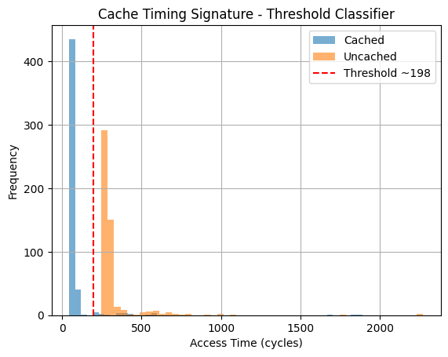
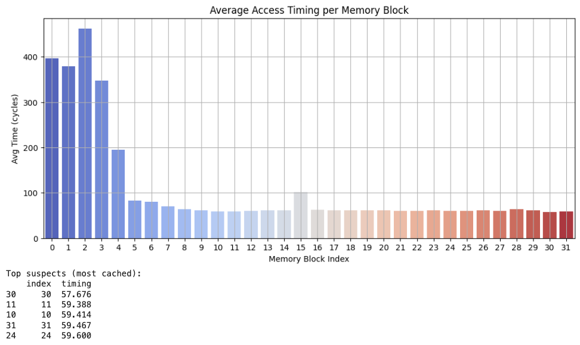

# ✅ 1. Cache Timing Classifier (Threshold Learning)
- Run multiple measurements of cached vs. uncached access.

- Record timings.

- Use the data to learn a timing threshold (e.g., via histogram or mean + std deviation).

- Use this threshold to classify whether a given access was cached or not.

## 🔁 Step 1: Update the C Code to Collect Multiple Samples
Measure both cases over many runs.

```
%%writefile cache_classifier.c
#include <stdio.h>
#include <stdlib.h>
#include <stdint.h>
#include <x86intrin.h>
#include <string.h>
#include <unistd.h>

#define SAMPLE_RUNS 1000
#define BLOCK_SIZE 64 * 1024

char *buffer;

uint64_t time_access(volatile char *addr) {
    uint64_t start, end;
    start = __rdtscp(&start);
    (void)*addr;
    end = __rdtscp(&end);
    return end - start;
}

void flush_cache(volatile char *addr) {
    _mm_clflush((void *)addr);
}

int main() {
    buffer = malloc(BLOCK_SIZE);
    memset(buffer, 1, BLOCK_SIZE);

    FILE *f = fopen("classifier_timings.csv", "w");
    fprintf(f, "run,timing,cached\n");

    for (int i = 0; i < SAMPLE_RUNS; i++) {
        int is_cached = i % 2;  // alternate runs

        if (!is_cached) {
            flush_cache(buffer); // flush it
        } else {
            volatile char tmp = buffer[0]; // simulate access
        }

        usleep(100); // simulate real-world gaps
        uint64_t t = time_access(buffer);

        fprintf(f, "%d,%lu,%d\n", i, t, is_cached);
    }

    fclose(f);
    free(buffer);
    return 0;
}

```

Compile and Run

```
!gcc -O2 cache_classifier.c -o cache_classifier
!./cache_classifier

```

Classifier with Threshold Learning

```
import pandas as pd
import matplotlib.pyplot as plt

df = pd.read_csv("classifier_timings.csv")

cached = df[df['cached'] == 1]['timing']
uncached = df[df['cached'] == 0]['timing']

# Compute a naive threshold
threshold = (cached.mean() + uncached.mean()) / 2
print(f"Suggested timing threshold: {threshold:.2f} cycles")

# Accuracy check
df['predicted_cached'] = df['timing'] < threshold
df['predicted_cached'] = df['predicted_cached'].astype(int)

accuracy = (df['cached'] == df['predicted_cached']).mean()
print(f"Classification accuracy: {accuracy:.2%}")

# Plot histogram
plt.hist(cached, bins=50, alpha=0.6, label="Cached")
plt.hist(uncached, bins=50, alpha=0.6, label="Uncached")
plt.axvline(threshold, color='red', linestyle='--', label=f"Threshold ~{int(threshold)}")
plt.xlabel("Access Time (cycles)")
plt.ylabel("Frequency")
plt.title("Cache Timing Signature - Threshold Classifier")
plt.legend()
plt.grid(True)
plt.show()

```




# ✅ 2. Multi-Run Access Pattern Profiling

Track which index was likely cached over repeated runs and reconstruct the “access pattern.”

Simulate a scenario where an attacker:
- Repeatedly probes multiple memory locations (like files).
- Profiles access over time.
- Infers which block was accessed more often based on aggregate timing.

## 🔁 Step 1: Generate Pattern in C

```
%%writefile access_pattern.c
#include <stdio.h>
#include <stdlib.h>
#include <stdint.h>
#include <x86intrin.h>
#include <unistd.h>
#include <string.h>

#define BLOCK_SIZE 4096
#define NUM_BLOCKS 32
#define ROUNDS 1000

char *mem;

uint64_t time_access(volatile char *addr) {
    uint64_t start, end;
    start = __rdtscp(&start);
    (void)*addr;
    end = __rdtscp(&end);
    return end - start;
}

void flush_cache(volatile char *addr) {
    _mm_clflush((void *)addr);
}

int main() {
    mem = malloc(NUM_BLOCKS * BLOCK_SIZE);
    memset(mem, 1, NUM_BLOCKS * BLOCK_SIZE);

    FILE *fp = fopen("pattern_timings.csv", "w");
    fprintf(fp, "round,index,timing\n");

    srand(42);
    for (int r = 0; r < ROUNDS; r++) {
        // Simulate someone accessing a secret index
        int secret_index = rand() % NUM_BLOCKS;
        volatile char tmp = mem[secret_index * BLOCK_SIZE];

        for (int i = 0; i < NUM_BLOCKS; i++) {
            flush_cache(&mem[i * BLOCK_SIZE]);
        }

        usleep(100);

        for (int i = 0; i < NUM_BLOCKS; i++) {
            uint64_t t = time_access(&mem[i * BLOCK_SIZE]);
            fprintf(fp, "%d,%d,%lu\n", r, i, t);
        }
    }

    fclose(fp);
    free(mem);
    return 0;
}

```

Compile and Run

```
!gcc -O2 access_pattern.c -o access_pattern
!./access_pattern

```

Analyze Access Pattern Over Rounds

```
import pandas as pd
import seaborn as sns
import matplotlib.pyplot as plt

df = pd.read_csv("pattern_timings.csv")

# Compute mean timing per index
avg_timings = df.groupby("index")["timing"].mean().reset_index()

# Lower average = more likely accessed frequently (i.e., cached more often)
plt.figure(figsize=(12, 5))
sns.barplot(data=avg_timings, x="index", y="timing", palette="coolwarm")
plt.title("Average Access Timing per Memory Block")
plt.xlabel("Memory Block Index")
plt.ylabel("Avg Time (cycles)")
plt.grid(True)
plt.show()

# Print top suspects
print("Top suspects (most cached):")
print(avg_timings.sort_values("timing").head())

```



✅ Trained a cache timing classifier.

✅ Simulated profiling patterns over time, just like real-world side-channel attackers do.

✅ Reconstructed hidden memory activity just from timing signals.


